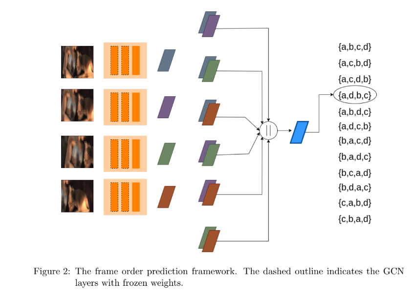

# frame_order_prediction_GCN
**Frame Order Prediction using GCN**

We present a graph convolutional network based representation learning framework to understand the spatio-temporal dependencies in videos. Since optical flow estimation requires an understanding of the statistical temporal structure of images, training with such a proxy task can allow us to learn rich representation. We validate the effectiveness of the learned representation on frame order prediction by taking temporally shuffled frames (i.e., in non-chronological order) as inputs. Similar to comparison-based sorting algorithms, we propose to extract features from all frame pairs and aggregate them to predict the correct order.

